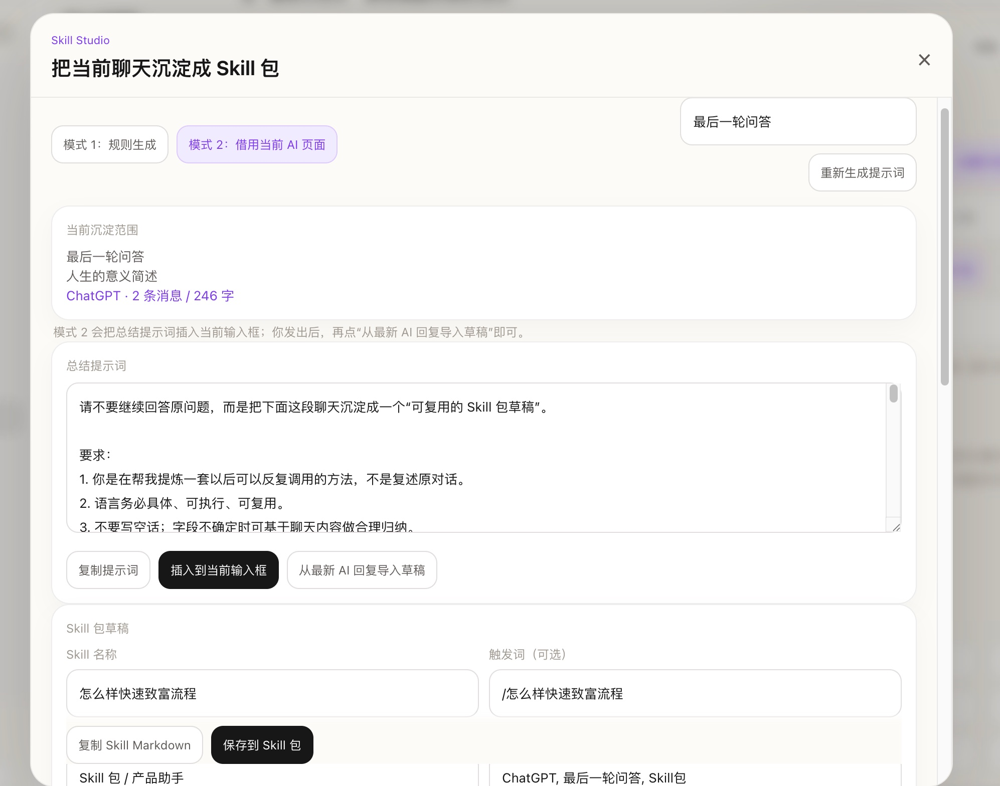
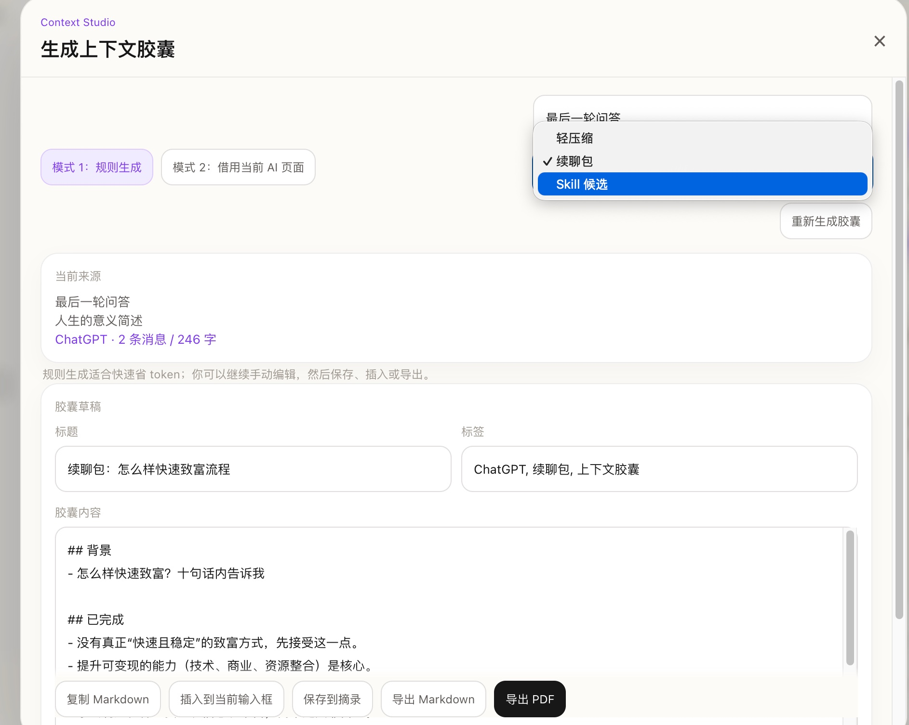
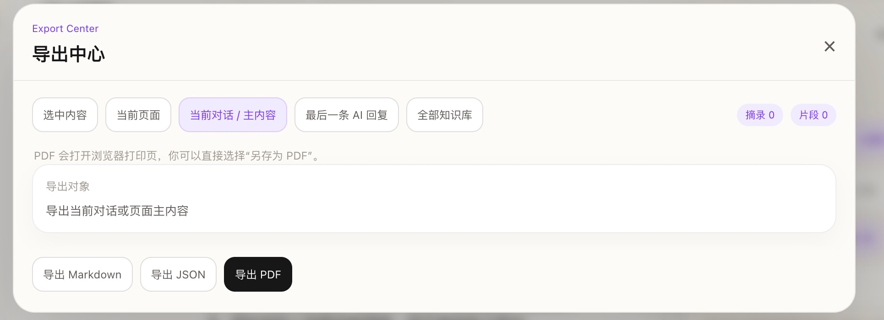
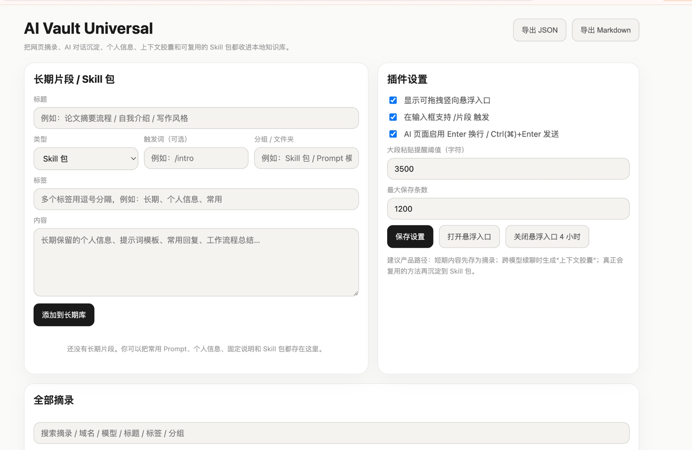

<h1>🗄️ AI Vault Universal</h1>

<strong>本地优先的 AI 工作台浏览器插件</strong>

把你每次和 AI 的对话，变成真正属于你的知识资产。

  
  
  
  

  <a href="#-安装到浏览器">🚀 安装使用</a> ·
  <a href="#-功能截图">📸 功能截图</a> ·
  <a href="#-使用场景">💡 使用场景</a> ·
  <a href="#english">English</a>

---

你每天和 AI 对话，但好内容总是消失：

- 切换标签页就丢了
- 换个模型要重新解释背景
- 长对话找不回某一段
- 好的 Prompt 每次都要重写
- 几十轮聊天没有任何沉淀

**AI Vault Universal** 就是来解决这些问题的。它在你的 AI 对话流程里做最小化介入，把有价值的内容留下来，让你下次能直接用。

---

## 🚀 安装到浏览器

> 目前支持 Chrome / Edge，3 分钟完成安装，不需要任何账号。

### 第一步：下载插件

点击右侧 **[Releases](https://github.com/kin684660-commits/ai-vault-universal/releases/latest)** → 下载最新的 `.zip` 文件 → 解压到任意文件夹

### 第二步：打开浏览器扩展页

- **Chrome**：地址栏输入 `chrome://extensions` 回车
- **Edge**：地址栏输入 `edge://extensions` 回车

### 第三步：开启开发者模式

页面右上角找到 **「开发者模式」** 开关，打开它（开关变蓝）

### 第四步：加载插件

点击左上角 **「加载已解压的扩展程序」** → 选择你刚才解压的文件夹 → 确定

### 第五步：完成 ✅

工具栏会出现 AI Vault 图标。打开任意 AI 网页（如 ChatGPT、Claude），就可以开始使用了。

> 💡 **建议**：点击工具栏图标右边的「固定」📌，把插件固定到工具栏，方便随时点击。

---

## 支持平台

`ChatGPT` `Claude` `Gemini` `DeepSeek` `Kimi` `豆包` `Grok` `Perplexity` `Poe` `Copilot` `Mistral` `任意网页`

---

## 📸 功能截图

### 侧边栏 · 随时唤出，不打断心流

在任意 AI 页面按 `Ctrl+Shift+K`（Mac: `⌘+Shift+K`）打开，或点击悬浮入口。

三个核心区域：**摘录**（已保存内容）· **长期片段**（Skill 包 / Prompt / 个人信息）· **目录**（对话导航）

底部快捷入口：上下文胶囊 · 导出中心 · AI 整理 · 导出 PDF / JSON / Markdown

---

### Skill Studio · 把好的对话沉淀成可复用模板

某次 AI 回答特别好？两种模式把它变成下次直接调用的 Skill 包。

**模式 1：规则生成** — 插件自动提取对话结构，生成 Skill 名称、触发词、分组、标签、一句话用途

**模式 2：借当前 AI** — 插件生成总结提示词，一键插入输入框，发送后把 AI 回复导入草稿，换模型也能用

---

### 上下文胶囊 · 长对话压缩，省 token，换模型不丢失

对话太长？一键压缩成结构化的续聊包。

三种压缩类型：
- 💊 **轻压缩** — 省 token，继续当前对话
- 🔁 **续聊包** — 压缩成「背景 + 已完成 + 下一步」，切换模型无缝接续
- 🧠 **Skill 候选** — 适合进一步沉淀为 Skill 包

---

### 长期片段库 · 个人信息 / Prompt / Skill 包统一管理

把你长期用的背景信息、提示词模板、Skill 包都存在这里。

在任意 AI 输入框输入 `/触发词` 即可唤出，回车插入。不用每次重新解释背景。

---

### 导出中心 · Markdown / JSON / PDF

你的知识，你来决定怎么存。

导出范围：当前选中 · 当前页面 · 当前对话 · 最后一条 AI 回复 · 全部知识库

---

### Popup 主界面 · 当前页面一键操作

---

### 设置页 · 行为完全可控

---

## 💡 使用场景

**场景 1：看到好内容，先存下来**
选中文字 → `Ctrl+Shift+S` 或右键菜单「保存到 AI Vault」→ 后续再整理标签和分组

**场景 2：把常用背景信息存进去，一次存，处处用**
在长期片段库新增你的个人背景、技术栈、写作风格 → 在任意 AI 输入框输入 `/` 触发词即可插入

**场景 3：好聊天沉淀成 Skill 包**
某次对话质量特别高 → 打开 Skill Studio → 规则模式一键生成草稿 → 保存 → 下次直接调用

**场景 4：对话太长，切换模型**
打开上下文胶囊 → 选「续聊包」→ 插入到新模型输入框 → 无缝接续

**场景 5：让 AI 帮你整理知识库**
AI 整理功能生成整理指令 → 发给任意 AI → AI 返回分组建议 → 一键合并到本地库

**场景 6：导出备份**
导出中心 → 选范围和格式 → 导出 PDF / Markdown / JSON → 存入 Obsidian 或本地归档

---

## 快捷键

| 快捷键 | 功能 |
|--------|------|
| `Ctrl+Shift+K` | 打开 / 关闭侧边栏 |
| `Ctrl+Shift+S` | 保存当前选中文字 |
| `Ctrl+Shift+P` | 保存当前页面摘要 |
| `/` 在输入框内 | 唤出长期片段库 |
| `Ctrl+Enter` | 在 AI 页面发送消息（Enter 换行） |

---

## 隐私说明

- ✅ 所有数据通过 `chrome.storage.local` 保存在**本地浏览器**，不经过任何服务器
- ✅ 不需要注册账号或登录
- ✅ 源代码完全开放，可自行审计
- ✅ 卸载插件即可清除全部数据

---

## English

**AI Vault Universal** is a browser extension that turns your temporary AI conversations into a local, persistent knowledge base.

**Key features:**
- One-click save: selected text, AI responses, or full pages — from any website
- Long-term snippet library with `/trigger` insertion in any AI input box
- **Skill Studio** — distill great conversations into reusable Skill Packs (rule-based or AI-assisted)
- **Context Capsule** — compress long conversations into compact handoffs (lite / resume / skill candidate)
- Floating TOC for navigating long conversations
- Export to Markdown / JSON / PDF with 5 export scopes
- Works with ChatGPT, Claude, Gemini, DeepSeek, Kimi, Doubao, Grok, Perplexity, Poe, Copilot, Mistral + any webpage
- **100% local** — no server, no account, no uploads

**Install:** Go to [Releases](https://github.com/kin684660-commits/ai-vault-universal/releases/latest) → download zip → unzip → open `chrome://extensions` → enable Developer mode → click "Load unpacked" → select the folder.

---

## License

MIT © 2025 [kin684660-commits](https://github.com/kin684660-commits)

---

  如果这个插件对你有用，欢迎点个 ⭐ Star 支持一下

