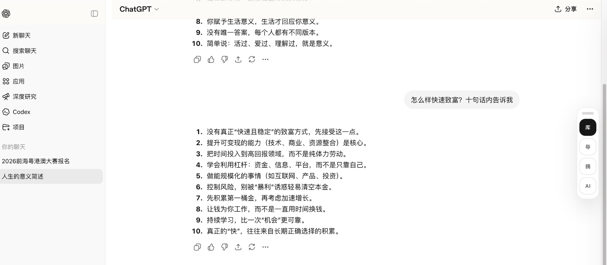
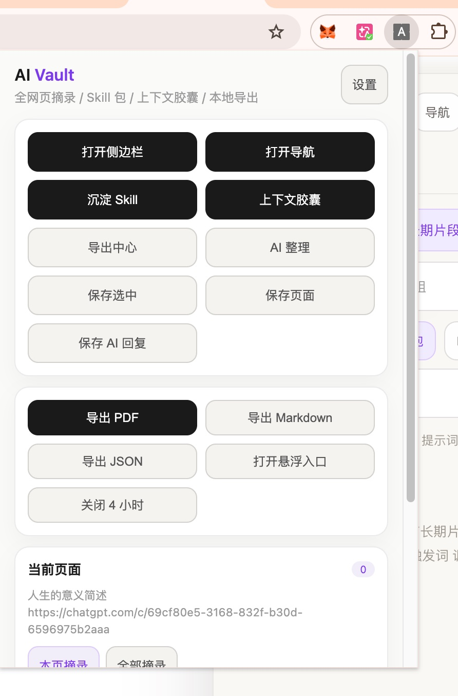
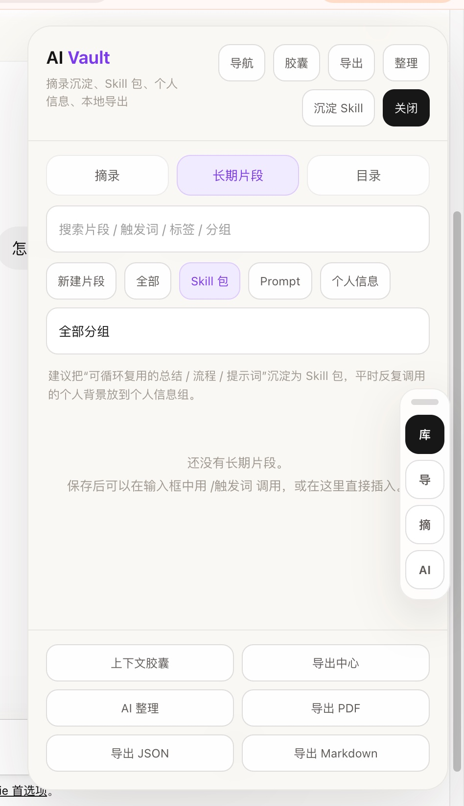
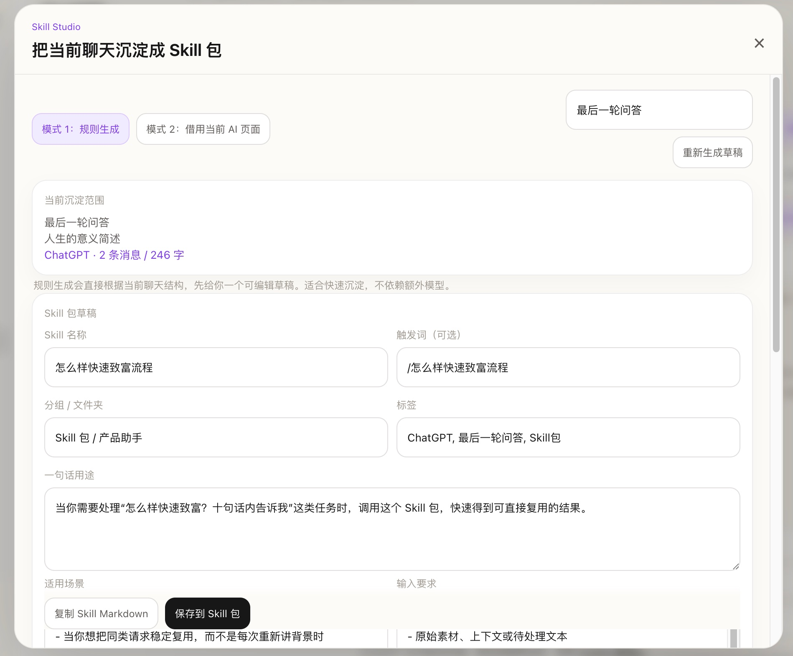

<h1>🗄️ AI Vault Universal</h1>

<strong>本地优先的 AI 工作台浏览器插件</strong>

把你每次和 AI 的对话，变成真正属于你的知识资产。

  
  
  
  

  <a href="#-安装">🚀 安装</a> ·
  <a href="#-怎么用">📖 怎么用</a> ·
  <a href="#-核心功能">✨ 功能</a> ·
  <a href="#english">English</a>

 

---

你每天和 AI 对话，但好内容总是消失：切换标签页就丢了，换个模型要重新解释背景，长对话找不回某一段，好的 Prompt 每次都要重写。

**AI Vault Universal** 解决这些问题。它嵌在你日常用的每一个 AI 页面里，把有价值的内容留下来，让你下次能直接用。

---

## 🚀 安装

> 支持 Chrome / Edge，约 2 分钟，不需要账号。

1. 前往 [Releases](https://github.com/kin684660-commits/ai-vault-universal/releases/latest) 下载最新 `.zip` 文件，解压到电脑上任意一个文件夹
2. 浏览器地址栏输入 `chrome://extensions`（Edge 输入 `edge://extensions`）回车
3. 右上角打开「**开发者模式**」（开关变蓝）
4. 点击「**加载已解压的扩展程序**」，选择刚才解压的文件夹
5. 点击浏览器工具栏右侧拼图图标 🧩，找到 AI Vault，点旁边的 📌 固定到工具栏

✅ 完成。打开任意网页或 AI 页面，就可以开始用了。

---

## 📖 怎么用

安装后，你有三个入口随时使用插件，不需要记任何快捷键：

### 入口一：点击工具栏图标

点击浏览器右上角的 **AI Vault 图标**，弹出操作面板。里面有所有功能的按钮，直接点击就能用。

面板里可以：保存当前选中文字 / 保存整个页面 / 保存最后一条 AI 回复 / 打开侧边栏 / 沉淀 Skill 包 / 生成上下文胶囊 / 导出内容

### 入口二：页面右侧悬浮按钮

在任意页面，右侧边缘会出现一组小按钮，可以用鼠标拖动到你喜欢的位置：

- **库** — 打开侧边栏，查看和管理所有已保存的内容
- **导** — 打开对话目录，在长对话里快速跳转
- **摘** — 一键保存当前页面选中的文字
- **AI** — 一键保存当前页面最后一条 AI 回复

### 入口三：右键菜单

在任意网页选中一段文字，右键 → **「保存选中文本到 AI Vault」**，直接保存，不需要打开任何面板。

---

## ✨ 核心功能

### 保存内容

三种方式随时保存，内容自动记录来源平台、页面标题和时间：

- **选中文字保存**：选中任意文字 → 右键保存，或点悬浮按钮「摘」
- **保存 AI 回复**：点悬浮按钮「AI」，自动抓取当前页面最后一条 AI 回复
- **保存整个页面**：点工具栏面板里的「保存页面」，保存页面全文摘要

### 侧边栏 · 管理所有内容

点工具栏图标 → 「打开侧边栏」，或直接点悬浮按钮「库」。侧边栏分三个区域：

- **摘录** — 所有已保存的内容，支持搜索、打标签、加分组、查看详情
- **长期片段** — Skill 包、个人信息、Prompt 模板，长期保存备用
- **目录** — 自动提取当前 AI 对话的问题节点，点击一步跳转

### 长期片段库 · 常用内容随时插入

把你的个人背景、常用 Prompt、Skill 包存进来，以后在任意 AI 输入框输入 `/触发词`，插件自动弹出匹配列表，回车插入。不用每次都重新解释背景。

### Skill Studio · 把好的对话沉淀成模板

某次 AI 回答特别好，想以后反复用？点工具栏图标 → 「沉淀 Skill」：

- **模式 1（规则生成）**：插件自动分析对话，生成 Skill 名称、触发词、适用场景、核心提示词，你直接确认保存
- **模式 2（借当前 AI）**：插件生成总结提示词 → 点「插入到当前输入框」→ 发送给 AI → AI 返回总结后点「导入草稿」→ 保存

### 上下文胶囊 · 长对话压缩，换模型不丢失

对话太长，token 快用完，或者想换个模型继续聊？点「上下文胶囊」，选一种压缩模式：

- **轻压缩** — 省 token，继续在当前模型聊
- **续聊包** — 压缩成「背景 + 已完成 + 下一步」的结构，粘贴到任意模型直接接续
- **Skill 候选** — 适合进一步沉淀成 Skill 包

### 导出

点工具栏图标 → 「导出中心」，选择范围和格式：

| 导出范围 | 导出格式 |
|---------|---------|
| 当前选中内容 | Markdown（适合 Obsidian / Notion）|
| 当前页面 | JSON（完整备份，可重新导入）|
| 当前对话 / 主内容 | PDF（本地存档）|
| 最后一条 AI 回复 | |
| 全部知识库 | |

---

## 支持平台

| AI 平台 | 普通网页 |
|---------|---------|
| ChatGPT · Claude · Gemini · DeepSeek · Kimi · 豆包 · Grok · Perplexity | 任意网页均可通过右键菜单保存选中文字 |

---

## 隐私

- ✅ 所有数据通过 `chrome.storage.local` 保存在**本地浏览器**，不经过任何服务器
- ✅ 不需要注册账号或登录
- ✅ 源代码完全开放，可自行审计
- ✅ 卸载插件即清除全部数据

---

## English

**AI Vault Universal** is a browser extension that turns your AI conversations into a local, persistent knowledge base.

**Three ways to use it — no shortcuts needed:**
1. Click the **toolbar icon** → pop-up panel with all features as buttons
2. **Floating buttons** on the right edge of any page (draggable): Library / Navigation / Save selection / Save AI reply
3. **Right-click menu** on any selected text → Save to AI Vault

**Key features:**
- Save selected text, AI responses, or full pages from any website
- Sidebar with captures, long-term snippets, and conversation TOC
- Long-term snippet library — type `/trigger` in any AI input box to insert
- **Skill Studio** — distill great conversations into reusable Skill Packs (2 modes)
- **Context Capsule** — compress long chats into handoffs for switching AI models
- Export to Markdown / JSON / PDF
- Works with ChatGPT, Claude, Gemini, DeepSeek, Kimi, Doubao, Grok, Perplexity + any webpage
- **100% local** — no server, no account, no uploads

**Install:** [Releases](https://github.com/kin684660-commits/ai-vault-universal/releases/latest) → download zip → unzip → open `chrome://extensions` → enable Developer mode → Load unpacked → select folder → pin to toolbar.

---

## License

MIT © 2025 [kin684660-commits](https://github.com/kin684660-commits)

 
如果对你有用，欢迎点个 ⭐ Star 支持一下

